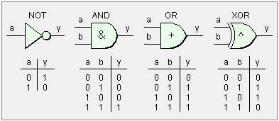
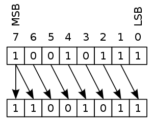
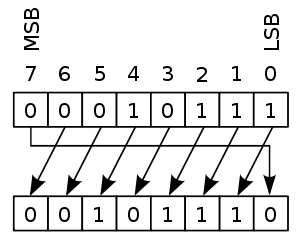
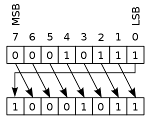
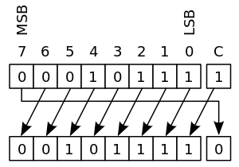
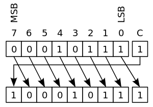

# Bit Manipulation

## Bitwise Operators



## Bit Shifts

Bit shift treats a value as a series of bits rather than as a numerical quantity. In these operations the digits are moved, or shifted, to the left or right

### Arithmetic Shift: Discarding ends

In an arithmetic shift, the bits that are shifted out of either end are discarded.
- In a left arithmetic shift, zeros are shifted in on the right;
- in a right arithmetic shift, the sign bit (the MSB in two's complement) is shifted in on the left, thus preserving the sign of the operand.

This example uses an 8-bit register:
```
   00010111 (decimal +23) LEFT-SHIFT
=  00101110 (decimal +46)

   10010111 (decimal −105) RIGHT-SHIFT
=  11001011 (decimal −53)
```




### Logical Shift

Zeros are shifted in to replace the discarded bits. Therefore, the logical and arithmetic left-shifts are exactly the same.

However, as the logical right-shift inserts value 0 bits into the most significant bit, instead of copying the sign bit, it is ideal for unsigned binary numbers, while the arithmetic right-shift is ideal for signed two's complement binary numbers.


### Circular Shift

#### Rotate

In this operation, sometimes called rotate no carry, the bits are "rotated" as if the left and right ends of the register were joined. This is useful if it is necessary to retain all the existing bits, and is frequently used in digital cryptography.





```
unsigned int x = ..., n = ...;
unsigned int y = (x << n) | (x >> (32 - n));
```

#### Rotate through carry






## Trivias

### Least Significant Bit (LSB)

Your first inclination to find the least-significant-bit (LSB) may be to search all bits in order of increasing significance util a bit is set:

```
template<typename T>
std::size_t find_lsb(const T& value)
{
	if (value == 0) throw std::invalid_argument("No bit set at all!");

	std::size_t bit = 0;

	while (! value & bit) ++bit;

	return bit;
}
```

### Most Significant Bit (MSB)

An efficient solution for a fixed size integer (say 32 bits) is to one by one set bits, then add 1 so that only the bit after MSB is set. Finally right shift by 1 and return answer. This solution does not require any condition checking.

```
Input : 10
Output : 8
Binary representation of 10 is 1010
The most significant bit corresponds
to decimal number 8.

Input : 18
Output : 16
```

```
int setBitNumber(int n)
{
    // Below steps set bits after
    // MSB (including MSB)

    // Suppose n is 273 (binary
    // is 100010001). It does following
    // 100010001 | 010001000 = 110011001
    n |= n >> 1;

    // This makes sure 4 bits
    // (From MSB and including MSB)
    // are set. It does following
    // 110011001 | 001100110 = 111111111
    n |= n >> 2;

    n |= n >> 4;
    n |= n >> 8;
    n |= n >> 16;

    // Increment n by 1 so that
    // there is only one set bit
    // which is just before original
    // MSB. n now becomes 1000000000
    n = n + 1;

    // Return original MSB after shifting.
    // n now becomes 100000000
    return (n >> 1);
}
```

## Interesting Matters

- [Bit Tricks for Competitive Programming](https://www.geeksforgeeks.org/bit-tricks-competitive-programming/)
- [Bit Manipulation by Peter Goldsborough](http://www.goldsborough.me/bits/c++/low-level/problems/2015/10/11/23-52-02-bit_manipulation/)
