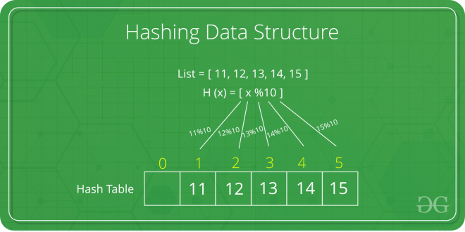

# Data Structure: Hash

The efficiency of mapping depends of the efficiency of the hash function used.



## Hash function

A good hash function should have following properties
- Efficiently computable.
- Should uniformly distribute the keys (Each table position equally likely for each key)


## [Hash Table](https://www.geeksforgeeks.org/hashing-set-1-introduction)

### Collisions

The situation where a newly inserted key maps to an already occupied slot in hash table is called collision and must be handled using some collision handling technique.

Following are the ways to handle collisions:

#### [Hash Chaining](https://www.geeksforgeeks.org/hashing-set-2-separate-chaining/)

Make each cell of hash table point to a linked list of records that have same hash function value. Chaining is simple, but requires additional memory outside the table.

The idea is to make each cell of hash table point to a linked list of records that have same hash function value.

Let us consider a simple hash function as “key mod 7” and sequence of keys as 50, 700, 76, 85, 92, 73, 101


**Advantages**
- Simple to implement.
- Hash table never fills up, we can always add more elements to chain.
- Less sensitive to the hash function or load factors.
- It is mostly used when it is unknown how many and how frequently keys may be inserted or deleted.

**Disadvantages**
- Cache performance of chaining is not good as keys are stored using linked list. Open addressing provides better cache performance as everything is stored in same table.
- Wastage of Space (Some Parts of hash table are never used)
- If the chain becomes long, then search time can become O(n) in worst case.
- Uses extra space for links.

**Performance of Chaining**  
Performance of hashing can be evaluated under the assumption that each key is equally likely to be hashed to any slot of table (simple uniform hashing).
```
 m = Number of slots in hash table
 n = Number of keys to be inserted in hash table

 Load factor α = n/m

 Expected time to search = O(1 + α)

 Expected time to insert/delete = O(1 + α)

 Time complexity of search insert and delete is
 O(1) if  α is O(1)
```

#### [Open Addressing](https://www.geeksforgeeks.org/hashing-set-3-open-addressing/)

In open addressing, all elements are stored in the hash table itself. Each table entry contains either a record or NIL. When searching for an element, we one by one examine table slots until the desired element is found or it is clear that the element is not in the table.

> Insert(k): Keep probing until an empty slot is found. Once an empty slot is found, insert k.
Search(k): Keep probing until slot’s key doesn’t become equal to k or an empty slot is reached.
Delete(k): Delete operation is interesting. If we simply delete a key, then search may fail. So slots of deleted keys are marked specially as “deleted”.

**Performance**
Like Chaining, the performance of hashing can be evaluated under the assumption that each key is equally likely to be hashed to any slot of the table (simple uniform hashing)

```
m = Number of slots in the hash table
n = Number of keys to be inserted in the hash table

Load factor α = n/m  ( < 1 )

Expected time to search/insert/delete < 1/(1 - α)

So Search, Insert and Delete take (1/(1 - α)) time
```

## Interesting Matters
- [Practice Question on Hashing](https://www.geeksforgeeks.org/practice-problems-on-hashing/)
