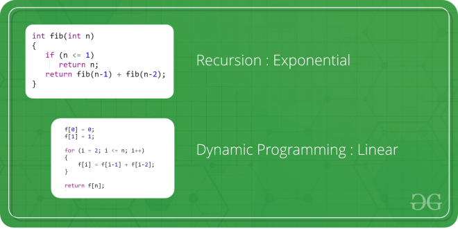

# Algorithm: Dynamic Programming

Dynamic Programming is mainly an **optimization over plain recursion**. The idea is to simply store the results of subproblems, so that we do not have to re-comupute them when needed later

## How
Steps to solve a DP
1) Identify if it is a DP problem  
2) Decide a state expression with least parameters  
3) Formulate state relationship      
4) Do tabulation (or add memoization)  

### Identify if it is a DP problem  

Typically, all the problems that require to maximize or minimize certain quantity or counting problems that say to count the arrangements under certain condition or certain probability problems can be solved by using Dynamic Programming.

All dynamic programming problems satisfy the overlapping subproblems property and most of the classic dynamic problems also satisfy the optimal substructure property. Once, we observe these properties in a given problem, be sure that it can be solved using DP.

### Decide a state expression with least parameters  

DP problems are all about **state and their transition**. This is the most basic step which must be done very carefully because the state transition depends on the choice of state definition you make.

A state can be defined as the set of parameters that can uniquely identify a certain position or standing in the given problem. This set of parameters should be as small as possible to reduce state space.

Example: Fibonacci(0) and fibonacci(1) is 1, which is the required state.

### Formulate state relationship  
    
### Do tabulation (or add memoization)  

## Types

There are following two different ways to store the values so that the values of a problem can be reused. Here, will discuss two patterns of solving DP problem:
- **Tabulation**: Bottom Up
- **Memoization**: Top Down

In this case the memory layout is linear that’s why it may seem that the memory is being filled in a sequential manner like the tabulation method, but you may consider any other top down DP having 2D memory layout like Min Cost Path, here the memory is not filled in a sequential manner.

## Properties

### Overlap Subproblems

Example: Fibonacci

### Optimal Substructure

Example: Shortest Path
