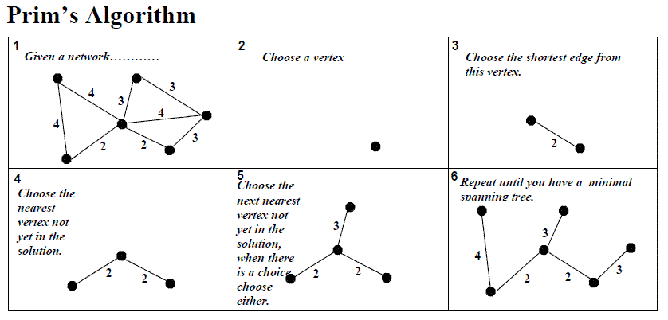

# [Graph Theory](https://www.geeksforgeeks.org/graph-data-structure-and-algorithms/)

A Graph consists of a finite set of vertices(or nodes) and set of Edges which connect a pair of nodes.


Graph is a data structure that consists of following two components:
- A finite set of vertices also called as nodes.
- A finite set of ordered pair of the form (u, v) called as edge. The pair is ordered because (u, v) is not same as (v, u) in case of a directed graph(di-graph). The pair of the form (u, v) indicates that there is an edge from vertex u to vertex v. The edges may contain weight/value/cost.

## [Representation](https://www.geeksforgeeks.org/graph-and-its-representations/)

There are two common ways to represent graph:

### Adjacency Matrix

Adjacency Matrix is a 2D array of size V x V where V is the number of vertices in a graph. Let the 2D array be adj[][], a slot adj[i][j] = 1 indicates that there is an edge from vertex i to vertex j.


**Pros**: Representation is easier to implement and follow. Removing an edge takes O(1) time. Queries like whether there is an edge from vertex ‘u’ to vertex ‘v’ are efficient and can be done O(1).

**Cons**: Consumes more space O(V^2). Even if the graph is sparse(contains less number of edges), it consumes the same space. Adding a vertex is O(V^2) time.
Please see this for a sample Python implementation of adjacency matrix.

### Adjacency List

An array of lists is used. Size of the array is equal to the number of vertices. Let the array be array[]. An entry array[i] represents the list of vertices adjacent to the *i* th vertex. This representation can also be used to represent a weighted graph. The weights of edges can be represented as lists of pairs. Following is adjacency list representation of the above graph.


## Trivias

### Minimum/Maximum Spanning Tree
Weight spanning tree is a subset of the edges of a connected, edge-weighted undirected graph that connects all the vertices together, without any cycles and with the significant amount possible (either maximum or minimum) total edge weight.


#### [Prim's MST](https://www.geeksforgeeks.org/prims-minimum-spanning-tree-mst-greedy-algo-5/)

In Prim’s algorithm also, we create a MST by picking edges one by one. We maintain two sets: a set of the vertices already included in MST and the set of the vertices not yet included. The Greedy Choice is to pick the smallest weight edge that connects the two sets.



#### [Kruskal's MST]

In Kruskal’s algorithm, we create a MST by picking edges one by one. The Greedy Choice is to pick the smallest weight edge that doesn’t cause a cycle in the MST constructed so far.

```
1. Sort all the edges in non-decreasing order of their weight.
2. Pick the smallest edge. Check if it forms a cycle with the spanning tree formed so far. If cycle is not formed, include this edge. Else, discard it.
3. Repeat step#2 until there are (V-1) edges in the spanning tree.
```


### Djikstra's Shortest Path

Given a graph and a source vertex in the graph, find shortest paths from source to all vertices in the given graph.


### DFS Traversals Application

Following are the problems that use DFS as a building block.

1) For an unweighted graph, DFS traversal of the graph produces the minimum spanning tree and all pair shortest path tree.

2) Detecting cycle in a graph
A graph has cycle if and only if we see a back edge during DFS. So we can run DFS for the graph and check for back edges. (See this for details)

3) Path Finding
We can specialize the DFS algorithm to find a path between two given vertices u and z.
i) Call DFS(G, u) with u as the start vertex.
ii) Use a stack S to keep track of the path between the start vertex and the current vertex.
iii) As soon as destination vertex z is encountered, return the path as the
contents of the stack

See this for details.

4) Topological Sorting
Topological Sorting is mainly used for scheduling jobs from the given dependencies among jobs. In computer science, applications of this type arise in instruction scheduling, ordering of formula cell evaluation when recomputing formula values in spreadsheets, logic synthesis, determining the order of compilation tasks to perform in makefiles, data serialization, and resolving symbol dependencies in linkers [2].

5) To test if a graph is bipartite
We can augment either BFS or DFS when we first discover a new vertex, color it opposited its parents, and for each other edge, check it doesn’t link two vertices of the same color. The first vertex in any connected component can be red or black! See this for details.

6) Finding Strongly Connected Components of a graph A directed graph is called strongly connected if there is a path from each vertex in the graph to every other vertex. (See this for DFS based algo for finding Strongly Connected Components)

7) Solving puzzles with only one solution, such as mazes. (DFS can be adapted to find all solutions to a maze by only including nodes on the current path in the visited set.)


### BFS Traversals Application

1) Shortest Path and Minimum Spanning Tree for unweighted graph In an unweighted graph, the shortest path is the path with least number of edges. With Breadth First, we always reach a vertex from given source using the minimum number of edges. Also, in case of unweighted graphs, any spanning tree is Minimum Spanning Tree and we can use either Depth or Breadth first traversal for finding a spanning tree.

2) Peer to Peer Networks. In Peer to Peer Networks like BitTorrent, Breadth First Search is used to find all neighbor nodes.

3) Crawlers in Search Engines: Crawlers build index using Breadth First. The idea is to start from source page and follow all links from source and keep doing same. Depth First Traversal can also be used for crawlers, but the advantage with Breadth First Traversal is, depth or levels of the built tree can be limited.

4) Social Networking Websites: In social networks, we can find people within a given distance ‘k’ from a person using Breadth First Search till ‘k’ levels.

5) GPS Navigation systems: Breadth First Search is used to find all neighboring locations.

6) Broadcasting in Network: In networks, a broadcasted packet follows Breadth First Search to reach all nodes.

7) In Garbage Collection: Breadth First Search is used in copying garbage collection using Cheney’s algorithm. Refer this and for details. Breadth First Search is preferred over Depth First Search because of better locality of reference:

8) Cycle detection in undirected graph: In undirected graphs, either Breadth First Search or Depth First Search can be used to detect cycle. In directed graph, only depth first search can be used.

9) Ford–Fulkerson algorithm In Ford-Fulkerson algorithm, we can either use Breadth First or Depth First Traversal to find the maximum flow. Breadth First Traversal is preferred as it reduces worst case time complexity to O(VE2).

10) To test if a graph is Bipartite We can either use Breadth First or Depth First Traversal.

11) Path Finding We can either use Breadth First or Depth First Traversal to find if there is a path between two vertices.

12) Finding all nodes within one connected component: We can either use Breadth First or Depth First Traversal to find all nodes reachable from a given node.

## References
- [GeeksForGeeks Exercise](https://www.geeksforgeeks.org/graph-theory-gq/)
-
