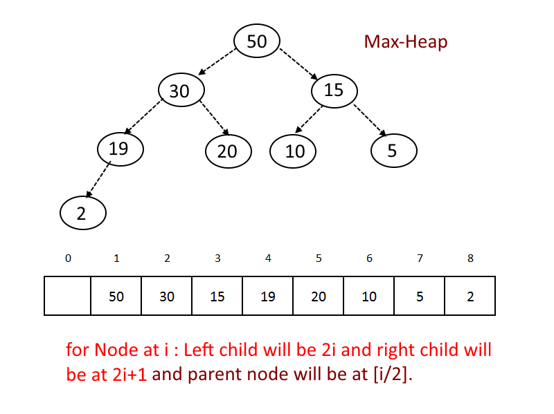

# Data Structure: Heap

## Definition

A heap is a tree-based data structure in **which all the nodes of the tree are in a specific order**.

The maximum number of children of a node in a heap depends on the type of heap. However, in the more commonly-used heap type, there are at most children of a node and it's known as a Binary heap.

STL Implementation:
- `priority_queue` on C++ (header: `queue`)
- Class `PriorityQueue<>` on Java (`java.util.*`)
- Lib `heapq` in Python (`import heapq`)

## Types

### Binary Heap
- Binary Heap has to be complete binary tree at all levels except the last level. This is called shape property.
- All nodes are either greater than equal to (Max-Heap) or less than equal to (Min-Heap) to each of its child nodes. This is called *heap property*.

## Implementation

- Use array to store the data.
- Start storing from index 1, not 0.
- For any given node at position i:
  - Its **Left Child** is at **[2*i]** if available.
  - Its **Right Child** is at **[2*i+1]** if available.
  - Its **Parent Node** is at **[i/2]** if available.

### Max Heap

### Min Heap

## [Operations](https://algorithms.tutorialhorizon.com/binary-min-max-heap/)

### Insertion

- Add the element at the bottom leaf of the Heap.
- Perform the Bubble-Up operation.
- All Insert Operations must perform the bubble-up operation(it is also called as up-heap, percolate-up, sift-up, trickle-up, heapify-up, or cascade-up)

### Bubble up Operation

- If inserted element is smaller than its parent node in case of Min-Heap OR greater than its parent node in case of Max-Heap, swap the element with its parent.
- Keep repeating the above step, if node reaches its correct position, STOP.

### Extract Min/ Extract Max Operation
Removing most significant node in the heap.

- Take out the element from the root.( it will be minimum in case of Min-Heap and maximum in case of Max-Heap).
- Take out the last element from the last level from the heap and replace the root with the element.
- Perform Sink-Down
- All delete operation must perform Sink-Down Operation ( also known as bubble-down, percolate-down, sift-down, trickle down, heapify-down, cascade-down).

### Deletion

- Find the index for the element to be deleted.
- Take out the last element from the last level from the heap and replace the index with this element .
- Perform Sink-Down

### Sink Down Operation

- If replaced element is greater than any of its child node in case of Min-Heap OR smaller than any if its child node in case of Max-Heap, swap the element with its smallest child(Min-Heap) or with its greatest child(Max-Heap).
- Keep repeating the above step, if node reaches its correct position, STOP.

## Complexity
| Field | Complexity |
|-------|------------|
|Space  | 	O(n)     |
|Search | 	O(n)     |
|Insert | 	O(log n) |
|Delete | 	O(log n) |

## Trivias

N/A
