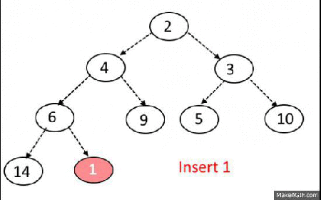

# Data Structure: Heap

## Definition

A heap is a tree-based data structure in **which all the nodes of the tree are in a specific order**.

The maximum number of children of a node in a heap depends on the type of heap. However, in the more commonly-used heap type, there are at most children of a node and it's known as a Binary heap.

STL Implementation:
- `priority_queue` on C++ (header: `queue`)
- Class `PriorityQueue<>` on Java (`java.util.*`)
- Lib `heapq` in Python (`import heapq`)

## Types

### Binary Heap
- Binary Heap has to be complete binary tree at all levels except the last level. This is called shape property.
- All nodes are either greater than equal to (Max-Heap) or less than equal to (Min-Heap) to each of its child nodes. This is called *heap property*.

#### Max Heap

#### Min Heap

## [Operations](https://algorithms.tutorialhorizon.com/binary-min-max-heap/)

### Bubble up Operation

- If inserted element is smaller than its parent node in case of Min-Heap OR greater than its parent node in case of Max-Heap, swap the element with its parent.
- Keep repeating the above step, if node reaches its correct position, STOP.

### Insertion
### Deletion
### Extract Min/Extract Max

## Orderings

## Trivias

### Lowest Common Ancestor

Should be recursive.
