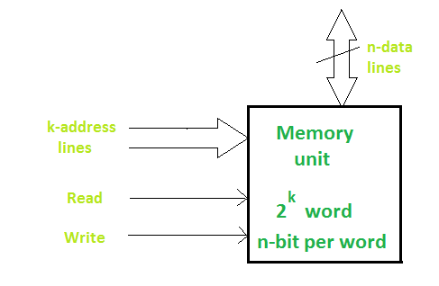

# Memory Units

Memories are made up of **registers**. Each register in the memory is one storage location. Storage location is also called as **memory location**. Memory locations are identified using **Address**. The total number of bit a memory can store is its capacity.

A storage element is called a **Cell**. Each register is made up of storage element in which one bit of data is stored. The data in a memory are stored and retrieved by the process called writing and reading respectively.

A word is a group of bits where a memory unit stores binary information. A word with group of 8 bits is called a byte.
A memory unit consists of data lines, address selection lines, and control lines that specify the direction of transfer. The block diagram of a memory unit is shown below:

## Memory leak

Memory leakage occurs in C++ when programmers allocates memory by using new keyword and forgets to deallocate the memory by using delete() function or delete[] operator. One of the most memory leakage occurs in C++ by using wrong delete operator.

If a program has memory leaks, then its memory usage is satirically increasing since all systems have limited amount of memory and memory is costly. Hence it will create problems.

### Countermeasure
- Instead of managing memory manually, try to use smart pointers where applicable.
  use `std::string` instead of `char *``. The `std::string` class handles all memory management internally, and it’s fast - and well-optimized.
- Never use a raw pointer unless it’s to interface with an older lib.
- The best way to avoid memory leaks in C++ is to have as few new/delete calls at the program level as possible – ideally NONE. Anything that requires dynamic memory should be buried inside an RAII object that releases the memory when it goes out of scope. RAAI allocate memory in constructor and release it in destructor, so that memory is - garanteed to be deallocated when the variable leave the current scope.
- Allocate memory by new keyword and deallocate memory by delete keyword and write all code between them.
