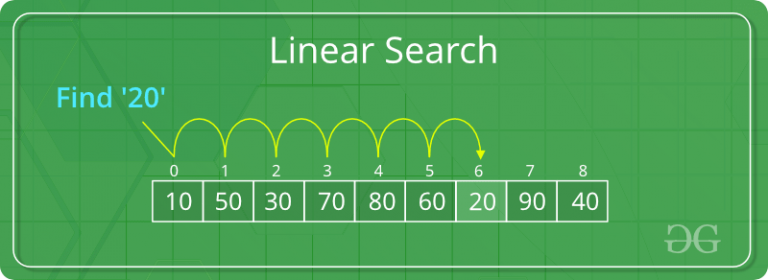
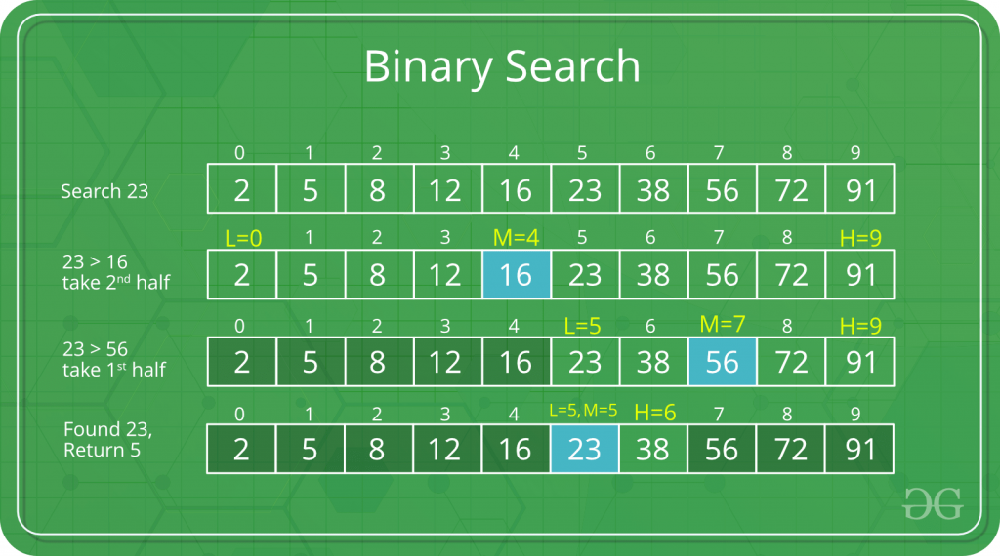

# [Algorithm: Searching](https://www.geeksforgeeks.org/searching-algorithms/)

Generally classified into two categories:

- Sequential Search: In this, the list or array is traversed sequentially and every element is checked. For example: Linear Search.
- Interval Search: These algorithms are specifically designed for searching in sorted data-structures. These type of searching algorithms are much more efficient than Linear Search as they repeatedly target the center of the search structure and divide the search space in half. For Example: Binary Search.

## Linear Search

The time complexity of above algorithm is O(n).



Mostly not used since now has been pre-optimized: caching, sorting, etc.


## [Binary Search](https://www.geeksforgeeks.org/binary-search/)

The time complexity of above algorithm is O(log n).



```cpp
int binarySearch(int arr[], int l, int r, int x)
{
    if (r >= l) {
        int mid = l + (r - l) / 2;
        if (arr[mid] == x)
            return mid;
        if (arr[mid] > x)
            return binarySearch(arr, l, mid - 1, x);

        return binarySearch(arr, mid + 1, r, x);
    }
    return -1;
}
```

## [Jump Search](https://www.geeksforgeeks.org/jump-search/)

- **Time Complexity** : O(√n)
- **Auxiliary Space** : O(1)

The basic idea is to check fewer elements (than linear search) by jumping ahead by fixed steps or skipping some elements in place of searching all elements.

Let’s consider the following array: (0, 1, 1, 2, 3, 5, 8, 13, 21, 34, 55, 89, 144, 233, 377, 610). Length of the array is 16. Jump search will find the value of 55 with the following steps assuming that the block size to be jumped is 4.  
- STEP 1: Jump from index 0 to index 4;
- STEP 2: Jump from index 4 to index 8;
- STEP 3: Jump from index 8 to index 12;
- STEP 4: Since the element at index 12 is greater than 55 we will jump back a step to come to index 9.
- STEP 5: Perform linear search from index 9 to get the element 55.

The optimal size of a block to be jumped is (√ n)
```cpp
int jumpSearch(int arr[], int x, int n)
{
    // Finding block size to be jumped
    int step = sqrt(n);

    // Finding the block where element is
    // present (if it is present)
    int prev = 0;
    while (arr[min(step, n)-1] < x)
    {
        prev = step;
        step += sqrt(n);
        if (prev >= n)
            return -1;
    }

    // Doing a linear search for x in block
    // beginning with prev.
    while (arr[prev] < x)
    {
        prev++;

        // If we reached next block or end of
        // array, element is not present.
        if (prev == min(step, n))
            return -1;
    }
    // If element is found
    if (arr[prev] == x)
        return prev;

    return -1;
}
```
