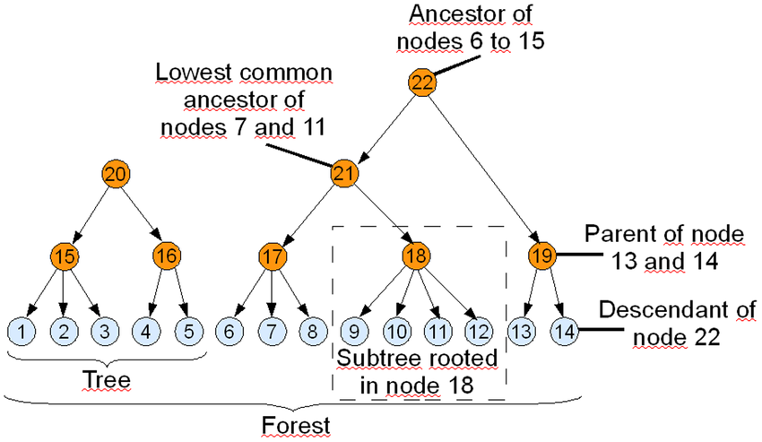

# Data Structure: Tree

## Definition

A tree is a *collection* of *entities* called **nodes**.  
Nodes are **connected by edges**.  
Each node **contains a value or data**, and it **may have a child node**.

```cpp
class Node {
    public:
        int data;
        // it may have more than one child
        vector<Node*> child; // can also be called edges

        Node(int d) {
            data = d;
            left = NULL;
            right = NULL;
        }
};
```

PS: Tree is basically a graph with two pointers, acyclic graph. If it has pointer to its root/parent, then it become a cyclic graph.  

### Terminologies
- Root: Top node in a tree
- Child: Nodes that are next to each other and connected downwards
- Parent: Converse notion of child
- Siblings: Nodes with the same parent
- Descendant: Node reachable by repeated proceeding from parent to child
- Ancestor: Node reachable by repeated proceeding from child to parent.
- Leaf: Node with no children
- Internal node: Node with at least one child
- External node: Node with no children

## Types

### N-ary tree

Basically tree with N-max child.

### Binary Tree
In computer science, a binary tree is a tree data structure in which **each node has at the most two children**, which are referred to as the left child and the right child.

```cpp

class Node {
    public:
        int data;
        Node *left;
        Node *right;
        Node(int d) {
            data = d;
            left = NULL;
            right = NULL;
        }
};
```

### Binary Search Tree
- The left subtree of a node contains only nodes with keys lesser than the node’s key.
- The right subtree of a node contains only nodes with keys greater than the node’s key.
- The left and right subtree each must also be a binary search tree.


#### Insertion
Insertion is done by checking the status of given data and the node data. If greater, go right, else go left.  
Here is recursion solution of insertion.

```cpp
void insert(Node* ptr, int data) {
  if(ptr == NULL) {
    ptr = new Node(data);
    return ptr;
  }
  if(ptr->data > data){
    if (ptr->left == NULL) ptr->left = new Node(data);
    else insert(ptr->left, data);
  }
  if(ptr->data < data){
    if (ptr->right == NULL) ptr->right = new Node(data);
    else insert(ptr->right, data);
  }
}
```

#### Deletion

There are three cases of this:
1. Node to be deleted is leaf: Simply remove from the tree.
```
              50                            50
           /     \         delete(20)      /   \
          30      70       --------->    30     70
         /  \    /  \                     \    /  \
       20   40  60   80                   40  60   80
 ```

 2. Node to be deleted is leaf: Simply remove from the tree.
 ```
                50                             50
              /     \         delete(30)      /   \
              30     70       --------->    40     70
              \    /  \                          /  \
              40  60   80                       60   80
  ```


3. Node to be deleted has two children: Find inorder successor of the node. Copy contents of the inorder successor to the node and delete the inorder successor. Note that inorder predecessor can also be used.
```
              50                            60
           /     \         delete(50)      /   \
          40      70       --------->    40    70
                 /  \                            \
                60   80                           80
 ```

```cpp
    /* Given a non-empty binary search tree, return the node with minimum
       key value found in that tree. Note that the entire tree does not
       need to be searched. */
    struct node * minValueNode(struct node* node)
    {
        struct node* current = node;

        /* loop down to find the leftmost leaf */
        while (current->left != NULL)
            current = current->left;

        return current;
    }

  /* Given a binary search tree and a key, this function deletes the key
     and returns the new root */
  struct node* deleteNode(struct node* root, int key)
  {
      // base case
      if (root == NULL) return root;

      // If the key to be deleted is smaller than the root's key,
      // then it lies in left subtree
      if (key < root->key)
          root->left = deleteNode(root->left, key);

      // If the key to be deleted is greater than the root's key,
      // then it lies in right subtree
      else if (key > root->key)
          root->right = deleteNode(root->right, key);

      // if key is same as root's key, then This is the node
      // to be deleted
      else
      {
          // node with only one child or no child
          if (root->left == NULL)
          {
              struct node *temp = root->right;
              free(root);
              return temp;
          }
          else if (root->right == NULL)
          {
              struct node *temp = root->left;
              free(root);
              return temp;
          }

          // node with two children: Get the inorder successor (smallest
          // in the right subtree)
          struct node* temp = minValueNode(root->right);

          // Copy the inorder successor's content to this node
          root->key = temp->key;

          // Delete the inorder successor
          root->right = deleteNode(root->right, temp->key);
      }
      return root;
  }
```
 Complexity: O(h), where `h` is height of the tree

### AVL
Also called as self-balancing tree.
To be updated

### Trie
> Note: This will be covered more on string subchapter.


## Traversals

### DFS (Depth First Search)

**Key: Stack**

```cpp
Node* dfs(Node* root, int value) {
  stack<Node*> search;
  search.push(root);

  while(!search.empty()) {
    Node* top = search.top();
    search.pop();
    if(top==value) return top;

    if(top->left) search.push(top->left);
    if(top->right) search.push(top->right);
  }
}

```

### BFS (Breadth First Search)

**Key: Queue**

```cpp
Node* bfs(Node* root, int value) {
  queue<Node*> search;
  search.push(root);

  while(!search.empty()) {
    Node* top = search.front();
    search.pop();
    if(top==value) return top;

    if(top->left) search.push(top->left);
    if(top->right) search.push(top->right);
  }
}

```

## Orderings

#### Pre Order (SLR)
**Key: SLR (Self, Left, Right)**

```cpp
vector<int> result;
void preorder(Node* root) {
  if(root==null) return;
  preOrderResult.push(root->data);
  preOrder(root->left);
  preOrder(root->right);
}

```

#### In Order (LSR)
**Key: LSR (Left, Self, Right)**

```cpp
vector<int> result;
void preorder(Node* root) {
  if(root==null) return;
  preOrder(root->left);
  preOrderResult.push(root->data);
  preOrder(root->right);
}

```

#### Post Order (LRS)
**Key: LSR (Left, Right, Self)**

```cpp
vector<int> result;
void preorder(Node* root) {
  if(root==null) return;
  preOrder(root->left);
  preOrder(root->right);
  preOrderResult.push(root->data);
}

```


## Trivias

### Lowest Common Ancestor


```cpp
Node* lca(struct Node * node, int key1, int key2)
{
	if(node == NULL) return NULL;

	if(node->val==key1 || node->val==key2) return node;

	Node *left = lca(node->left, key1, key2);
	Node *right = lca(node->right, key1, key2);

	if(left && right) return node;
	else{
		return left!=NULL ? left : right;
	}

}
```

### Maximum depth trees

The idea is to do a post-order traversal and maintain two variables to store the left depth and right depth and return max of both the depths.


```cpp
int maxDepth(struct node* node)
{
    if (node==NULL)
        return 0;
    else
    {
         /* compute the depth of each subtree */
          int lDepth = maxDepth(node->left);
          int rDepth = maxDepth(node->right);

          /* use the larger one */
          if (lDepth > rDepth)
                return(lDepth+1);
          else
               return(rDepth+1);
   }
}
```

## Applications

- a Manipulate hierarchical data
- Make information easy to search (see tree traversal)
- Manipulate sorted lists of data
- Use as a workflow for compositing digital images for visual effects
- Use in router algorithms
